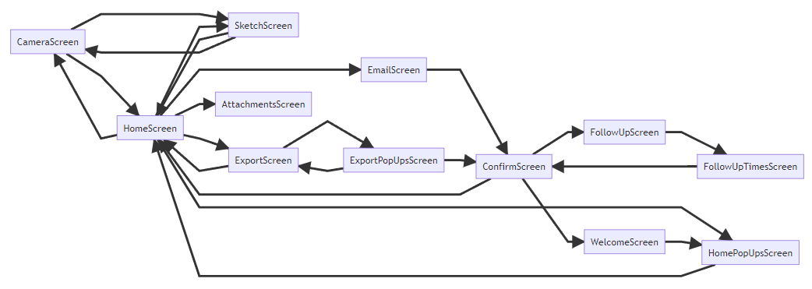

# Documentation Guideline for Power Apps

## What to document?
Based on the recomendation from Microsoft within the [learning path](https://docs.microsoft.com/en-us/learn/modules/document-test-powerapps-app/04-engage-customer), the following types of documentation should be considered. Not all of them can be created automatically. However [powerapps-docstring](https://github.com/sebastian-muthwill/powerapps-docstring) can provide a functionality to create at least a view of them.

- **Definitions**
- Architecture and design (partly)
- **Technical specifications**
- End-User documentation
- Change log

In addition to this the following things should also be concidered for documentation:

- Project scope and definition
- Use cases and targeted user (groups)
- Overall system architecture
- Database architecture
- Deployment process
- **Connections**
- **Screen flows**
- Global variables*
- Context variables*
- Collections*
>*) can be explained within the docstring

## How to document?
A bare minimun are comments withing the Power Apps functions itself. Each created function should have a comment with an overview what this function is trying to accomplish and what the boundary conditions are.

Taking this a step further, each screen, and main objects on the screen should be explained in a way, a person without knowledge of this application could get a good overview within a short period of time.

To reduce efforts and to avoid manual documentation creation, a good practice is to embed the documentation creation into the development process of the application.

### Docstring and commenting convention
Based on the following conventions [powerapps-docstring](https://github.com/sebastian-muthwill/powerapps-docstring) is able to extract the docstrings from the code and create a documentation file automatically. 

Therefore documentation strings should be placed at the beginning of a property enclosed in /* This is the docstring */

Following the good practice for docstrings in Python [https://www.python.org/dev/peps/pep-0257/#id17](https://www.python.org/dev/peps/pep-0257/#id17)

they can be either single line docstrings :

```
/* This is a single line docstring. */
```

or multi line docstrings:
```
/* This is a multi line docstring

A detailed explenation can follow here and
take up as many lines as needed
*/
```

Code comments can occur everywhere in between beginning with // followed by blank

```
// This is a code comment
```

#### Docstring on app level

App related documentation is placed at the beginning of the `App.OnStart` property (later also App.StartApp)
on app level.

Example:
```
/* This application enables endusers to book their working hours effectivly.

With this app the endusers can manage their working hours according our internal
policy. …

Foo bar…
*/
```

#### Docstrings on screen level

To create a docstring for the screen level, place a docstring at the beginning of the `OnVisible` propperty of the screen.

## Documentation content

### App scope and definition

This is a overall verbal description of the app project, it's intention and scope.

Write down some key information, why this app was created, which purpose does it has and
what will change if this app is implemented and used. What are the benefits? Which problem will be solved?

### Use cases and targeted user (groups)

Describe the use cases of this app and whom is this app targetting?

Usually you start with an use case diagram before creating the app. This makes clear what use cases the
app will serve and who is ment to use it. More: [Wiki - use case](https://en.wikipedia.org/wiki/Use_case)

### Overall system architecture

Describe how the system will interact with other components or systems.

Is there a flow running or is the data, which is stored somewhere, is used by another system?
Everythin what helps to get an overall picture will help.

### Database architecture

Describe your database type and architecture. 

Usually an entity relationship model is created which represents the tables and their relations in your database. More: [Wiki - entity relationship model](https://en.wikipedia.org/wiki/Entity%E2%80%93relationship_model)

### Deployment process

Describe how the app is deployed, updated and maintained.

### Connections
Are created automatically.

### Screen flows
A visualization for screenflows is created in [powerapps-docstring](https://github.com/sebastian-muthwill/powerapps-docstring) automatically based on the Navigate() functions.

 _Screenflow from example_

### Global variables

Description of your global variables

### Context variables

Description of your context variables

### Collections

Description of your collections
